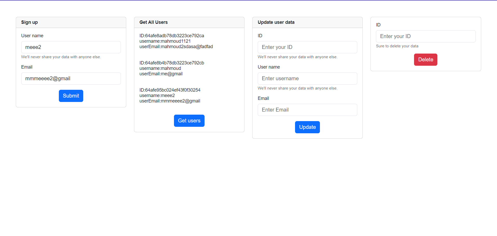
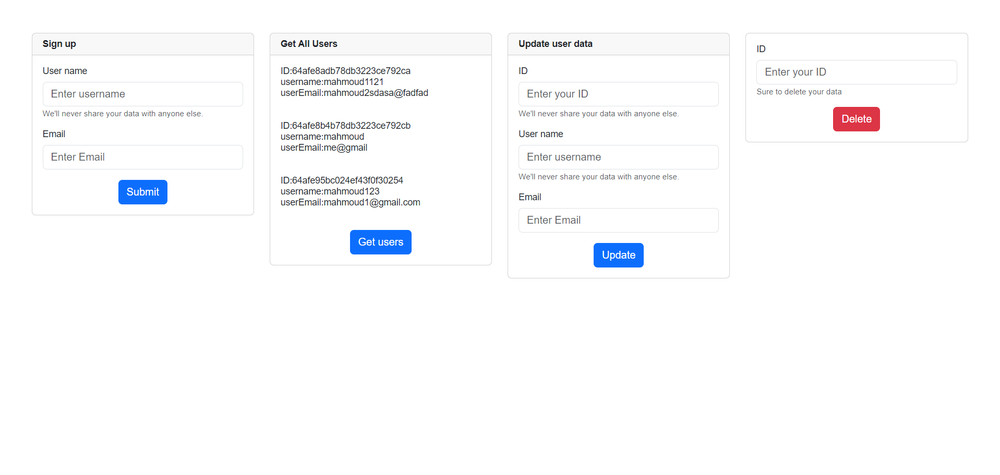
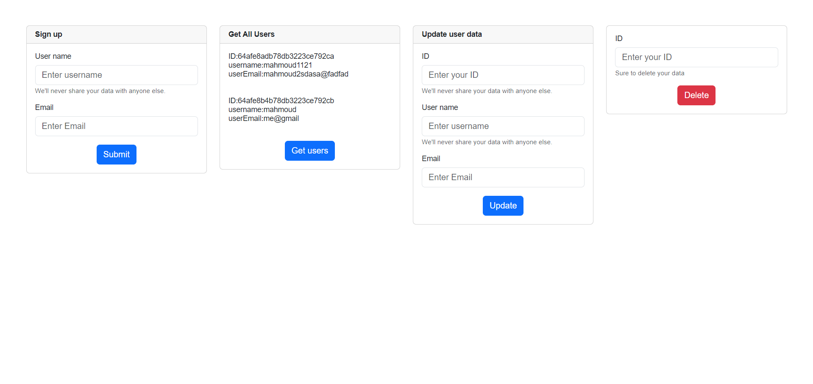

# !!Simple-Nodejs-Mongo-CRUD!!

# how to run
# npm install 
# npm install -g bower
# npm install -g nodemon
# bower install bootstrap
# nodemon
    
#  !! Tech used !!
# Express
# Mongo DB (Mongoose)
# HandleBars (HBS)
# bower components 
# Bootstrap
# Controller for User
    
# !! Whats it can do !!
# Create User
# Read All Users
# Update User
# Delete User
